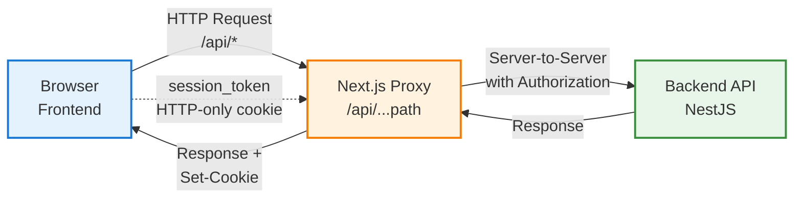
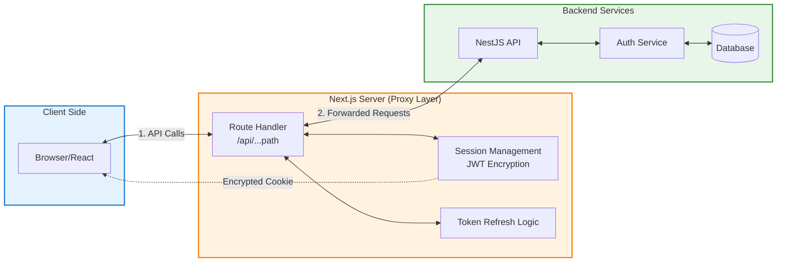
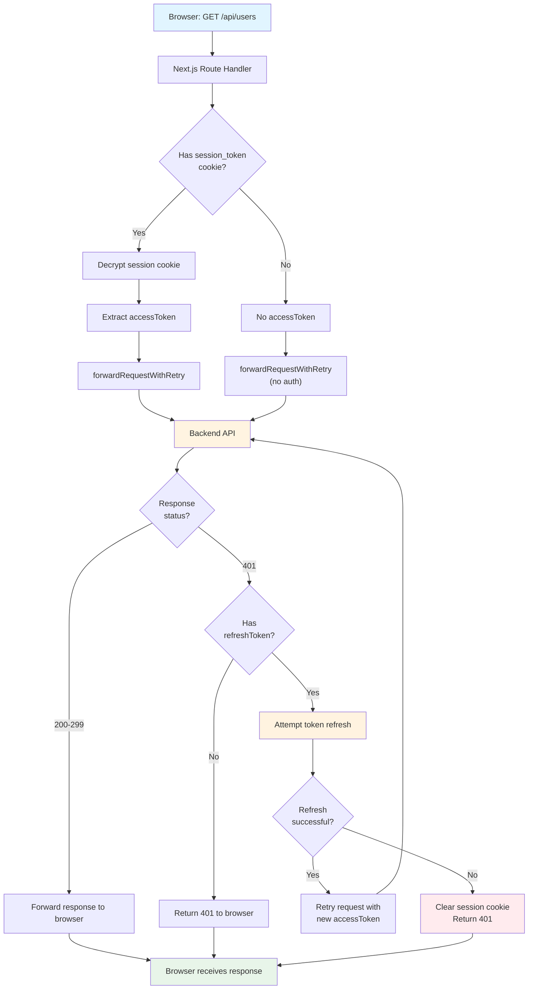
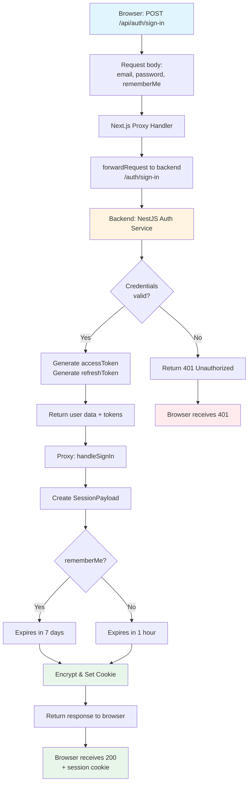
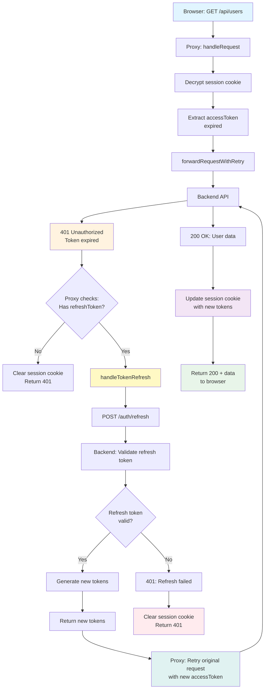
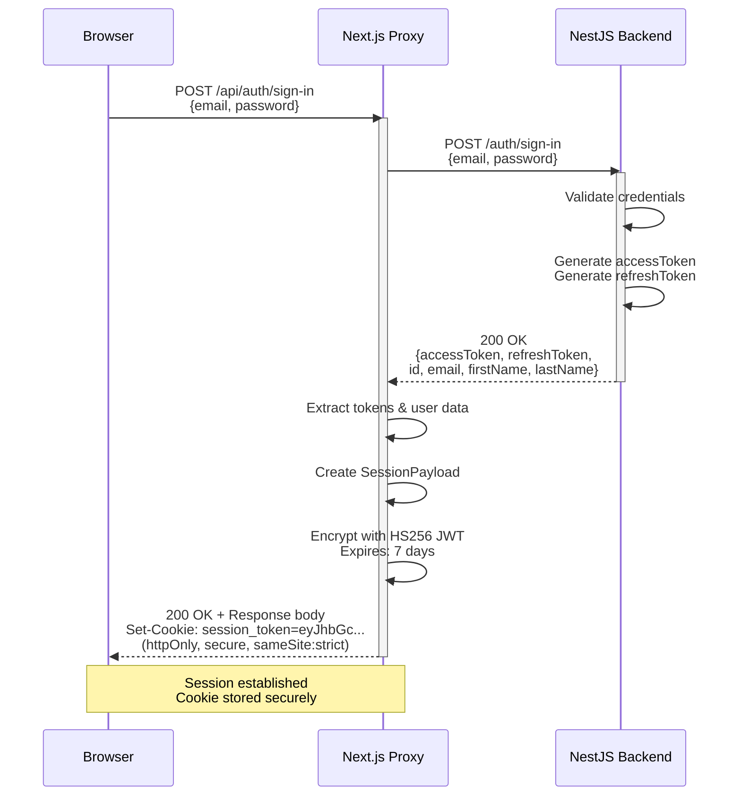
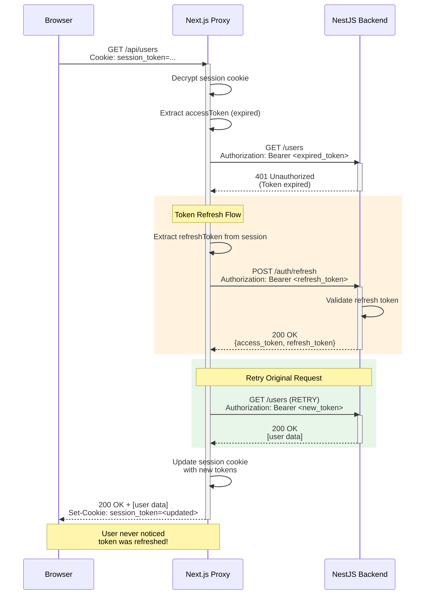

# Next.js API Proxy - Complete Guide

## Table of Contents
1. [Overview](#overview)
2. [Architecture](#architecture)
3. [File Structure](#file-structure)
4. [Core Concepts](#core-concepts)
5. [Request Flow](#request-flow)
6. [Key Components](#key-components)
7. [Authentication Flow](#authentication-flow)
8. [Token Management](#token-management)
9. [Configuration](#configuration)
10. [Modification Guide](#modification-guide)

---

## Overview

This API proxy is a **Next.js Route Handler** that acts as an intermediary between your frontend application and the NestJS backend. It provides:

- **Catch-all routing**: All API requests go through `/api/*`
- **Automatic token management**: Handles access/refresh tokens transparently
- **Secure session storage**: Encrypts tokens in HTTP-only cookies
- **Automatic token refresh**: Retries failed requests with refreshed tokens
- **CORS bypass**: Avoids browser CORS restrictions
- **Security**: Keeps sensitive tokens away from client-side JavaScript

---

## Architecture



**Flow Overview:**


### Why Use a Proxy?

1. **Token Security**: Tokens stored in HTTP-only cookies (inaccessible to JavaScript/XSS)
2. **Simplified Frontend**: Frontend doesn't need to manage token refresh logic
3. **CORS Handling**: Server-to-server communication avoids CORS issues
4. **Centralized Auth**: Single point for authentication logic
5. **SSR Compatible**: Works with both client and server components

---

## File Structure

```
frontend/
├── app/api/[...path]/route.ts    # Main proxy route handler
├── lib/
│   ├── config.ts                  # Environment & endpoint configuration
│   ├── session.ts                 # Session encryption/decryption (JWT) & cookie helpers
│   └── proxy-utils.ts             # Shared proxy utilities (headers, refresh, retry)
```

---

## Core Concepts

### 1. Catch-All Route: `[...path]`

The folder name `[...path]` is a **Next.js catch-all dynamic route**:

- **Matches**: `/api/*` any path after `/api/`
- **Examples**:
  - `/api/users` → `path = ["users"]`
  - `/api/auth/sign-in` → `path = ["auth", "sign-in"]`
  - `/api/users/123/posts` → `path = ["users", "123", "posts"]`

The `path` parameter is an array of path segments that gets reconstructed into the full path.

### 2. Route Handlers (HTTP Methods)

```typescript
export const GET = createHandler;
export const POST = createHandler;
export const PUT = createHandler;
export const DELETE = createHandler;
export const PATCH = createHandler;
export const OPTIONS = createHandler;
```

Each HTTP method uses the same `createHandler` function, which delegates to `handleRequest`. This allows the proxy to forward **any HTTP method**.

### 3. Session Payload

```typescript
interface SessionPayload {
  id: string;
  email: string;
  firstName: string;
  lastName: string;
  accessToken: string;
  refreshToken: string;
  rememberMe: boolean;
}
```

This structure holds:
- User information (id, email, name)
- Authentication tokens (access & refresh)
- Session persistence preference (`rememberMe`)

Stored **encrypted** as a JWT in an HTTP-only cookie.

---

## Request Flow

### Standard Request Flow



### Authentication Request Flow (Sign In)



### Token Refresh Flow



---

### Flow Diagram Legend

- 🔵 **Blue boxes**: Client (Browser) operations
- 🟡 **Yellow boxes**: Backend API operations  
- 🟣 **Purple boxes**: Encryption/Security operations
- 🟢 **Green boxes**: Successful completion
- 🔴 **Red boxes**: Error/Failure states
- 🟠 **Orange/Light yellow**: Token refresh operations

---

## Key Components

### 1. `handleRequest()` - Main Request Handler

**Purpose**: Orchestrates the entire request/response cycle

```typescript
async function handleRequest(
  request: NextRequest,
  params: Promise<{ path: string[] }>
) {
  // 1. Get session from cookie
  const sessionToken = await getCookieValue(SESSION_TOKEN_COOKIE);
  const sessionPayload = sessionToken ? await decrypt(sessionToken) : undefined;
  
  // 2. Reconstruct backend path
  const resolvedParams = await params;
  const fullPath = `/${resolvedParams.path.join("/")}`;
  
  // 3. Check for file upload / large request
  const isFileUpload = contentType.includes("multipart/form-data");
  if (isFileUpload) {
    return forwardRequestStreaming(request, fullPath, accessToken);
  }
  
  // 4. Cache request body (can only be read once)
  const cachedBody = request.method !== "GET" && request.method !== "HEAD" 
    ? await request.text() 
    : undefined;
  
  // 5. Forward to backend with retry logic
  let response = await forwardRequestWithRetry(request, fullPath, accessToken, cachedBody);
  
  // 6. Handle 401 with token refresh
  if (response.status === 401 && sessionPayload && refreshToken) {
    response = await handleTokenRefresh(...);
  }
  
  // 7. Handle special endpoints (Sign-in/Sign-out)
  if (fullPath === SIGN_IN_ENDPOINT && response.ok) {
    return handleSignIn(response, rememberMe);
  }
  
  // 8. Forward response
  return createNextResponse(response, await response.text());
}
```

**Key Details**:
- **Streaming Support**: Handles file uploads and large requests via `forwardRequestStreaming`.
- **Retry Logic**: Uses `forwardRequestWithRetry` for robustness.
- **Body Caching**: Caches non-GET bodies for potential retries.
- **Async Params**: Compatible with Next.js 15+ async params.

---

### 2. `forwardRequestWithRetry()` - Robust Proxying

**Purpose**: Forwards requests with automatic retries for network/server errors

```typescript
async function forwardRequestWithRetry(
  request: NextRequest,
  path: string,
  accessToken?: string,
  cachedBody?: string,
  retries: number = 2,
  timeoutMs: number = 30000
): Promise<Response> {
  // ... retry loop implementation ...
  // 1. Sets up AbortController for timeout
  // 2. Calls forwardRequest()
  // 3. Retries on 5xx errors or timeouts
  // 4. Uses exponential backoff (1s, 2s, etc.)
}
```

**Features**:
- **Retries**: Automatically retries 5xx errors (up to 2 times by default).
- **Timeout**: Enforces a 30s timeout per attempt.
- **Backoff**: Waits longer between each retry attempt.

---

### 3. `forwardRequestStreaming()` - File Uploads

**Purpose**: Handles large payloads and file uploads without buffering

```typescript
async function forwardRequestStreaming(
  request: NextRequest,
  path: string,
  accessToken?: string
): Promise<Response> {
  // ...
  const options: RequestInit = {
    method: request.method,
    headers,
    body: request.body, // Stream directly
    duplex: "half",     // Required for streaming
  };
  
  return fetch(backendUrl, options);
}
```

**Note**: Streaming requests **cannot be automatically retried** if they fail, as the stream is consumed on the first attempt.

---

### 4. `proxy-utils.ts` - Shared Utilities

This file contains reusable logic to keep `route.ts` clean:

- **`prepareHeaders`**: Adds `Authorization`, preserves `user-agent`, removes `host`/`cookie`.
- **`refreshAccessToken`**: Calls backend to get new tokens.
- **`createNextResponse`**: Helper to format Next.js responses.
- **`createStreamingResponse`**: Helper for streaming responses (downloads).

---

### 5. `handleTokenRefresh()` - Retry with New Token

```typescript
async function handleTokenRefresh(
  request: NextRequest,
  fullPath: string,
  sessionPayload: SessionPayload,
  refreshToken: string,
  cachedBody?: string
): Promise<NextResponse | null> {
  // 1. Call refreshAccessToken
  const refreshResult = await refreshAccessToken(...);
  
  if (!refreshResult) {
    // Refresh failed → clear session
    return createErrorResponse("TOKEN_REFRESH_FAILED", ...);
  }
  
  // 2. Retry original request with new token
  const response = await forwardRequestWithRetry(
    request, 
    fullPath, 
    refreshResult.access_token, 
    cachedBody
  );
  
  // 3. Update session cookie with new tokens
  await setSessionCookie(
    nextResponse.cookies,
    { ...sessionPayload, ...newTokens },
    sessionPayload.rememberMe ? ... : undefined
  );
  
  return nextResponse;
}
```

---

### 6. `handleSignIn()` - Session Creation

```typescript
async function handleSignIn(
  response: Response, 
  rememberMe?: boolean
): Promise<NextResponse> {
  // 1. Extract data
  const data = await response.json();
  
  // 2. Create session payload
  const sessionPayload = { ...data, rememberMe };
  
  // 3. Set Cookie
  if (rememberMe) {
    await setSessionCookie(res.cookies, sessionPayload, new Date(Date.now() + 7d));
  } else {
    await setSessionCookie(res.cookies, sessionPayload); // Session cookie
  }
  
  return nextResponse;
}
```

**What Happens**:
1. Extract tokens + user data from backend response
2. Create session payload
3. Encrypt as JWT
4. Set as HTTP-only cookie
5. Return response to frontend

---

### 7. Session Encryption (`session.ts`)

```typescript
export async function encrypt(payload: SessionPayload) {
  return new SignJWT(payload)
    .setProtectedHeader({ alg: "HS256" })
    .setIssuedAt()
    .setExpirationTime(
      payload.rememberMe 
        ? new Date(Date.now() + SESSION_EXPIRES_IN) 
        : new Date(Date.now() + 60 * 60 * 1000)
    )
    .sign(encodedKey);
}

export async function decrypt(session: string | undefined = "") {
  try {
    const { payload } = await jwtVerify(session, encodedKey, {
      algorithms: ["HS256"],
    });
    return payload as SessionPayload;
  } catch (error) {
    console.log("Failed to verify session", error);
  }
}
```

**Security**:
- **Algorithm**: HS256 (HMAC with SHA-256)
- **Secret**: `SESSION_SECRET` environment variable
- **Expiration**: Dynamic (7 days for rememberMe, 1 hour otherwise)
- **Storage**: HTTP-only cookie (inaccessible to JavaScript)

---

### 8. Cookie Configuration (`session.ts`)

```typescript
export function getSessionTokenOption(token: string, expires?: Date) {
  return {
    name: SESSION_TOKEN_COOKIE,
    value: token,
    httpOnly: true,
    secure: process.env.NODE_ENV === "production",
    sameSite: "lax" as const,
    path: "/",
    expires,
  };
}
```

**Cookie Flags**:
- **httpOnly**: Prevents XSS attacks (JS can't read cookie)
- **secure**: HTTPS only in production
- **sameSite: lax**: Balances security and usability (allows top-level navigation)
- **expires**: Matches the JWT expiration

---

## Authentication Flow

### Complete Sign-In Sequence



### Authenticated Request with Refresh



---

## Configuration

### Environment Variables (`.env.local`)

```bash
# Backend API URL (without trailing slash)
BACKEND_API_URL=http://localhost:3001

# Session encryption secret (use strong random string)
SESSION_SECRET=your-super-secret-key-min-32-chars
```

### Config File (`lib/config.ts`)

```typescript
export const BACKEND_API_URL = process.env.BACKEND_API_URL;
export const SIGN_IN_ENDPOINT = "/auth/sign-in"; 
export const SIGN_OUT_ENDPOINT = "/auth/sign-out"; 
export const REFRESH_ENDPOINT = "/auth/refresh"; 
export const SESSION_SECRET = process.env.SESSION_SECRET;
export const SESSION_TOKEN_COOKIE = "session_token";
```

**Modifiable Values**:
- **Endpoint paths**: Change if your backend uses different routes
- **Cookie name**: Change `SESSION_TOKEN_COOKIE` if needed
- **Token expiration**: Currently 7 days (hardcoded in `encrypt()` and cookie options)

---

## Modification Guide

### Common Modifications

#### 1. Change Token Expiration

**In `lib/session.ts`**:
```typescript
export async function encrypt(payload: SessionPayload) {
  return new SignJWT(payload)
    // ...
    .setExpirationTime("30d")  // Change expiration here
    .sign(encodedKey);
}
```

**In `lib/config.ts`**:
```typescript
export const SESSION_EXPIRES_IN = 30 * 24 * 60 * 60 * 1000; // Update constant
```

---

#### 2. Add Additional Session Data

**Update `SessionPayload` in `lib/session.ts`**:
```typescript
export interface SessionPayload extends JWTPayload {
  id: string;
  email: string;
  firstName: string;
  lastName: string;
  role: string;           // NEW
  permissions: string[];  // NEW
  accessToken: string;
  refreshToken: string;
}
```

**Update `handleSignIn()` in `route.ts`**:
```typescript
const { accessToken, refreshToken, id, email, firstName, lastName, role, permissions } = data;

const sessionPayload = {
  id,
  email,
  firstName,
  lastName,
  role,           // NEW
  permissions,    // NEW
  accessToken,
  refreshToken,
};
```

---

#### 3. Add Request/Response Logging

**In `forwardRequest()`**:
```typescript
async function forwardRequest(...) {
  console.log("Forwarding request to backend:", backendUrl);
  
  const startTime = Date.now();
  const response = await fetch(backendUrl, options);
  const duration = Date.now() - startTime;
  
  console.log(`Backend responded: ${response.status} in ${duration}ms`);
  
  return response;
}
```

---

#### 4. Add Custom Headers

**In `prepareHeaders()`**:
```typescript
function prepareHeaders(request: NextRequest, accessToken?: string): Headers {
  const headers = new Headers(request.headers);
  
  if (accessToken) {
    headers.set("Authorization", `Bearer ${accessToken}`);
  }
  
  // Add custom headers
  headers.set("X-Frontend-Version", "1.0.0");
  headers.set("X-Client-Type", "web");
  
  // Rest of function...
}
```

---

#### 5. Handle Multiple Authentication Schemes

```typescript
// Add to config.ts
export const API_KEY_ENDPOINTS = ["/public/data", "/webhooks"];

// Modify prepareHeaders()
function prepareHeaders(request: NextRequest, accessToken?: string, fullPath?: string): Headers {
  const headers = new Headers(request.headers);
  
  // Use API key for specific endpoints
  if (fullPath && API_KEY_ENDPOINTS.includes(fullPath)) {
    headers.set("X-API-Key", process.env.API_KEY!);
  } else if (accessToken) {
    headers.set("Authorization", `Bearer ${accessToken}`);
  }
  
  // Rest of function...
}
```

---

#### 6. Add Request Rate Limiting

```typescript
// Create lib/rate-limit.ts
const requestCounts = new Map<string, { count: number; resetTime: number }>();

export function checkRateLimit(ip: string, limit: number = 100): boolean {
  const now = Date.now();
  const record = requestCounts.get(ip);
  
  if (!record || now > record.resetTime) {
    requestCounts.set(ip, { count: 1, resetTime: now + 60000 }); // 1 minute
    return true;
  }
  
  if (record.count >= limit) {
    return false;
  }
  
  record.count++;
  return true;
}

// In route.ts handleRequest()
const ip = request.headers.get("x-forwarded-for") || "unknown";
if (!checkRateLimit(ip)) {
  return NextResponse.json(
    { error: "Too many requests" },
    { status: 429 }
  );
}
```

---

#### 7. Add Response Caching

```typescript
// Create simple in-memory cache
const responseCache = new Map<string, { data: string; timestamp: number }>();

async function getCachedResponse(key: string, maxAge: number): Promise<string | null> {
  const cached = responseCache.get(key);
  if (!cached) return null;
  
  if (Date.now() - cached.timestamp > maxAge) {
    responseCache.delete(key);
    return null;
  }
  
  return cached.data;
}

// In handleRequest() for GET requests
if (request.method === "GET") {
  const cacheKey = `${fullPath}${url.search}`;
  const cached = await getCachedResponse(cacheKey, 60000); // 1 minute
  
  if (cached) {
    return new NextResponse(cached, { status: 200 });
  }
}
```

---

#### 8. Handle WebSocket Proxying

Note: Next.js Route Handlers don't support WebSocket upgrades. For WebSocket support, you'd need a custom Node.js server or use a different approach.

**Alternative**: Use a dedicated WebSocket proxy or connect directly to backend WebSocket from client.

---

#### 9. Add Request Validation

```typescript
import { z } from "zod";

// Define schemas
const signInSchema = z.object({
  email: z.string().email(),
  password: z.string().min(8),
});

// In handleRequest()
if (fullPath === SIGN_IN_ENDPOINT && request.method === "POST") {
  try {
    const body = JSON.parse(cachedBody || "{}");
    signInSchema.parse(body);
  } catch (error) {
    return NextResponse.json(
      { error: "Invalid request body" },
      { status: 400 }
    );
  }
}
```

---

#### 10. Add Error Monitoring

```typescript
// Add to handleRequest()
try {
  // ... existing logic
} catch (error) {
  console.error("Proxy error:", error);
  
  // Send to monitoring service (e.g., Sentry)
  if (process.env.NODE_ENV === "production") {
    // Sentry.captureException(error);
  }
  
  return NextResponse.json(
    { error: "Internal server error" },
    { status: 500 }
  );
}
```

---

### Advanced Modifications

#### 1. Support Multiple Backends

```typescript
// In config.ts
export const BACKENDS = {
  auth: process.env.AUTH_API_URL,
  users: process.env.USERS_API_URL,
  posts: process.env.POSTS_API_URL,
};

// In forwardRequest()
function getBackendUrl(path: string): string {
  if (path.startsWith("/auth")) return BACKENDS.auth;
  if (path.startsWith("/users")) return BACKENDS.users;
  if (path.startsWith("/posts")) return BACKENDS.posts;
  return BACKEND_API_URL; // default
}

const backendUrl = `${getBackendUrl(path)}${path}${url.search}`;
```

---

#### 2. Add Request Transformation

```typescript
async function transformRequestBody(
  body: string,
  fullPath: string
): Promise<string> {
  // Add common fields
  const parsed = JSON.parse(body);
  parsed.timestamp = new Date().toISOString();
  parsed.source = "web";
  
  return JSON.stringify(parsed);
}

// In forwardRequest()
if (cachedBody !== undefined) {
  options.body = await transformRequestBody(cachedBody, fullPath);
}
```

---

#### 3. Add Response Transformation

```typescript
async function transformResponse(
  data: string,
  fullPath: string
): Promise<string> {
  const parsed = JSON.parse(data);
  
  // Remove sensitive fields
  delete parsed.internalId;
  delete parsed.createdBy;
  
  // Add metadata
  parsed._metadata = {
    timestamp: new Date().toISOString(),
    source: "api",
  };
  
  return JSON.stringify(parsed);
}

// In handleRequest()
const data = await response.text();
const transformed = await transformResponse(data, fullPath);
return createNextResponse(response, transformed);
```

---

## Debugging Tips

### 1. Enable Detailed Logging

```typescript
const DEBUG = process.env.DEBUG === "true";

function log(...args: any[]) {
  if (DEBUG) {
    console.log("[API Proxy]", ...args);
  }
}

// Use throughout
log("Session payload:", sessionPayload);
log("Forwarding to:", backendUrl);
log("Response status:", response.status);
```

### 2. Inspect Session Cookie

**Browser DevTools** → Application → Cookies → `session_token`

**Decode JWT** (for debugging only, not in production):
```typescript
// Add temporary endpoint
if (fullPath === "/debug/session") {
  const session = await getSession();
  return NextResponse.json(session);
}
```

### 3. Test Refresh Flow

```typescript
// Force 401 for testing
if (fullPath === "/debug/force-401") {
  return NextResponse.json({ error: "Forced 401" }, { status: 401 });
}
```

---

## Security Considerations

1. **SESSION_SECRET**: Must be strong and unique. Generate with:
   ```bash
   openssl rand -base64 32
   ```

2. **HTTPS in Production**: Always use HTTPS. The `secure` flag ensures cookies are only sent over HTTPS.

3. **Cookie Flags**: Never remove `httpOnly` or `sameSite: strict`.

4. **Token Expiration**: Balance security vs UX. Shorter = more secure, longer = better UX.

5. **CORS**: If you bypass the proxy and call backend directly, configure CORS properly.

6. **Sensitive Data**: Don't log tokens or sensitive data in production.

7. **Environment Variables**: Never commit `.env.local` to git.

---

## Performance Optimization

1. **Connection Pooling**: Node.js `fetch` uses connection pooling by default.

2. **Response Streaming**: **Already Implemented**. The proxy automatically streams:
   - File uploads (multipart/form-data)
   - Binary responses (images, PDFs, zips)
   - Large downloads

3. **Caching**: Add caching for GET requests (see modification #7).

4. **CDN**: Deploy Next.js to a CDN (Vercel, Cloudflare) for edge caching.

---

## Testing

### Unit Tests (Example with Jest)

```typescript
// __tests__/api-proxy.test.ts
import { encrypt, decrypt } from "@/lib/session";

describe("Session encryption", () => {
  it("should encrypt and decrypt session", async () => {
    const payload = {
      id: "1",
      email: "test@example.com",
      firstName: "John",
      lastName: "Doe",
      accessToken: "token",
      refreshToken: "refresh",
      rememberMe: false,
    };
    
    const encrypted = await encrypt(payload);
    const decrypted = await decrypt(encrypted);
    
    expect(decrypted).toMatchObject(payload);
  });
});
```

### Integration Tests

Use a tool like **Playwright** or **Cypress** to test the full flow:

```typescript
test("sign in and make authenticated request", async ({ page }) => {
  await page.goto("/sign-in");
  await page.fill('input[name="email"]', "test@example.com");
  await page.fill('input[name="password"]', "password123");
  await page.click('button[type="submit"]');
  
  // Verify cookie is set
  const cookies = await page.context().cookies();
  expect(cookies.find(c => c.name === "session_token")).toBeDefined();
  
  // Make authenticated request
  const response = await page.request.get("/api/users");
  expect(response.status()).toBe(200);
});
```

---

## Troubleshooting

### Issue: "Unauthorized" on every request

**Causes**:
- `SESSION_SECRET` mismatch between encryption/decryption
- Cookie not being sent (check cookie domain/path)
- Backend rejecting tokens

**Debug**:
```typescript
console.log("Session token:", sessionToken);
console.log("Decrypted payload:", sessionPayload);
console.log("Access token:", accessToken);
```

### Issue: Refresh loop (constant 401)

**Causes**:
- Refresh token expired
- Backend refresh endpoint not working
- Refresh token not being updated in session

**Fix**: Check `handleTokenRefresh()` is updating the cookie.

### Issue: CORS errors

**Causes**:
- Calling backend directly instead of through proxy
- Misconfigured CORS on backend

**Fix**: Ensure all API calls go through `/api/*`.

### Issue: Body already consumed error

**Causes**:
- Reading `request.body` multiple times

**Fix**: Use `cachedBody` pattern (already implemented).

---

## Summary

This API proxy provides:
✅ Transparent authentication token management  
✅ Automatic token refresh with retry logic  
✅ Secure session storage (HTTP-only cookies)  
✅ Server-side forwarding (CORS bypass)  
✅ Centralized error handling  
✅ Extensible architecture  

**Key Files**:
- `route.ts`: Main proxy logic
- `session.ts`: JWT encryption/decryption & cookie configuration
- `proxy-utils.ts`: Shared proxy utilities
- `config.ts`: Environment constants

**Modification Strategy**:
1. Read the current code thoroughly
2. Identify the function responsible for your change
3. Test changes in development
4. Add logging for debugging
5. Consider security implications

This guide should give you complete understanding of the proxy architecture and enable you to make any modifications you need.
